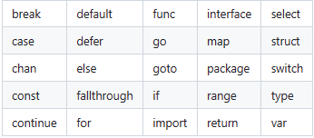

* 区分大小写
* 文件名不能以数字开头：例如 1ab
* _是一个特殊的标识符，称之为空白标识符，任何赋值给这个标识符的的值都将被抛弃
* 没有名称的变量 ：匿名变量
* 25个关键字



* 每个语句不需要像 C 家族中的其它语言一样以分号 ; 结尾


###### go语言有包的概念，如同C#的命名空间，每个程序都由pkg包的概念组成，一个包可以由许多以 .go 为扩展名的源文件组成，因此文件名和包名一般来说都是不相同的。


##### 包的编译可见性规则
* 当标识符（包括常量、变量、类型、函数名、结构字段等等）以一个大写字母开头，如：Group1，那么使用这种形式的标识符的对象就可以被外部包的代码所使用（客户端程序需要先导入这个包），这被称为导出（像面向对象语言中的 public）；
* 标识符如果以小写字母开头，则对包外是不可见的，但是它们在整个包的内部是可见并且可用的（像面向对象语言中的 private ）。


* 函数的定义语法
```go
func functionName(parameter_list) (return_value_list) {
	...
}

```
* parameter_list 的形式为 (param1 type1, param2 type2, …)
* parameter_list 的形式为 (param1 type1, param2 type2, …)


##### go文件的编译顺序
* 在完成包的 import 之后，开始对常量、变量和类型的定义或声明。
* 如果存在 init() 函数的话，则对该函数进行定义（这是一个特殊的函数，每个含有该函数的包都会首先执行这个函数）。
* 如果当前包是 main 包，则定义 main() 函数。
* 然后定义其余的函数，首先是类型的方法，接着是按照 main() 函数中先后调用的顺序来定义相关函数，如果有很多函数，则可以按照字母顺序来进行排序。


##### Go 程序的执行（程序启动）顺序如下：
1. 按顺序导入所有被 main 包引用的其它包，然后在每个包中执行如下流程：
2. 如果该包又导入了其它的包，则从第一步开始递归执行，但是每个包只会被导入一次。
3. 然后以相反的顺序在每个包中初始化常量和变量，如果该包含有 init() 函数的话，则调用该函数。
4. 在完成这一切之后，main 也执行同样的过程，最后调用 main() 函数开始执行程序。

###### 因此所有的转换都必须显式说明，就像调用一个函数一样（类型在这里的作用可以看作是一种函数）
```go
a := 5.0
b := int(a)
```